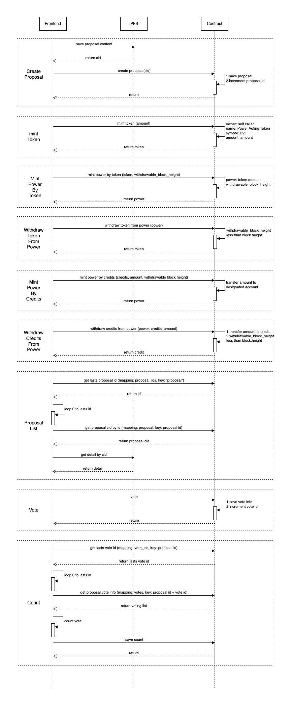
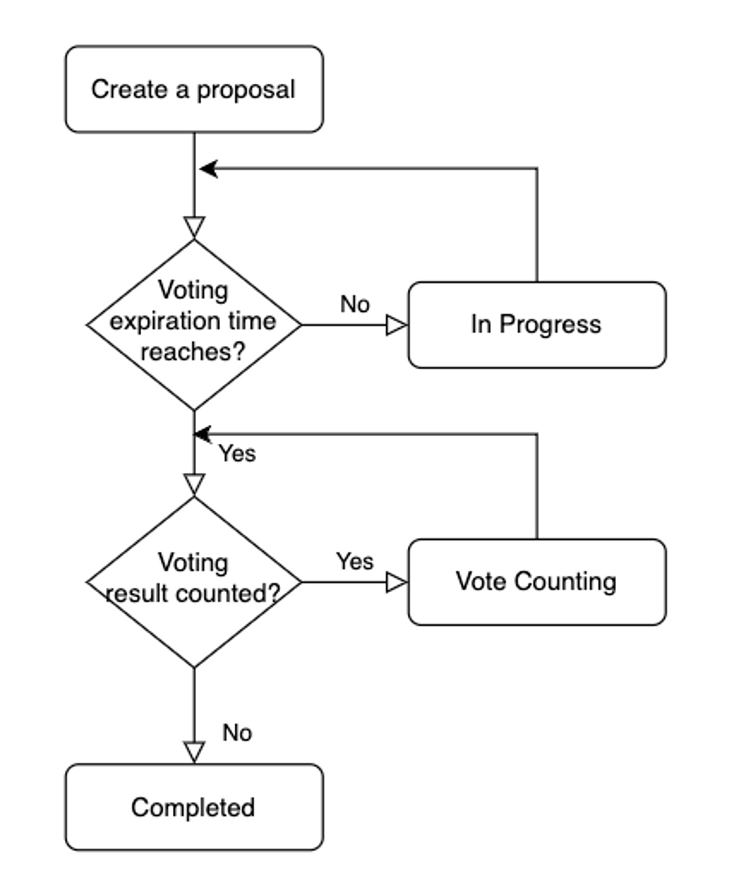
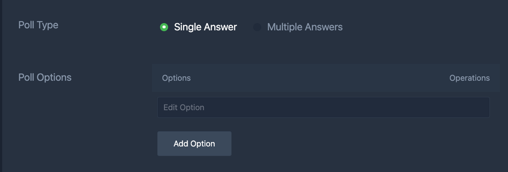

## 1. Overview

Power Voting dApp utilizes ZKP and timelock to achieve fair and private voting. Before the voting deadline, no one’s voting results will be seen by others, and the voting process will not be disturbed by other participant’s voting results. After the voting deadline, anyone can count the votes in a decentralized manner, and the results of the counting will executed and stored by smart contract and will not be manipulated by any centralized organization or individual. 

Power Voting dApp aims to become the infrastructure of DAO governance.

## 2. Problem

In the community voting process governed by DAO, since the voting data of other community members can be seen before the vote counting time, the community members will be affected by the existing voting data before voting, and some members will even take advantage of a large number of voting rights in their hands to vote at the end of the voting process to make the voting results are reversed, resulting in unfair voting.

In the centralized voting process, since the vote counting power is in the hands of the centralized organization, it will cause problems such as vote fraud and black box operation of vote counting, resulting in the voting results being manipulated by others, which cannot truly reflect the wishes of the community.

## 3. Solution

Power Voting dApp stores voting information on the blockchain, and all voting operations are executed on the chain, which is open and transparent. 

When community members vote, they use the timelock technology to lock the voting content, and voting content cannot be viewed until the voting expiration time reaches, so that no one can know the voting information of other members before voting expiration time reaches. 

After the counting time arrives, any voting participant can initiate a vote count without being affected by any centralized organization.

All the voting power, credits and voting information are stored in record, voting participants’ privacy won’t be disclosed. After voting counted, all the results are stored in mapping, anyone can count and view the voting result.

## 4. Timelock

When creating a proposal, the creator will enter a voting expiration time, and Power Voting dApp will store the proposal content and voting expiration time together on the blockchain. When user queries voting content, Power Voting dApp will check to see if it reaches voting expiration time. Power Voting dApp will lock all users' voting content and not allow anyone to query voting content until voting expiration time, to make sure no one can know the voting information of other members before voting expiration time reaches.

## 5. Voting Power

Power Voting supports two ways to obtain voting power: one is to pledge third-party tokens to obtain voting rights, and the other is to pledge credits.aleo points to obtain voting rights. When the pledge period ends, users can destroy their voting power and exchange them for third-party tokens and credits.aleo points back.

## 6. Timing Diagram

## 7. Proposal State Flow

## 8. Proposal Type

Power Voting dApp supports Single Answer and Multiple Answers proposals and can customize at most 10 options.

## 9. One More Thing

Power Voting dApp uses Soter | Aleo Wallet Chrome extention to retrieve records and execute contracts, please make sure you've installed the extention before experiencing Power Voting dApp features.
